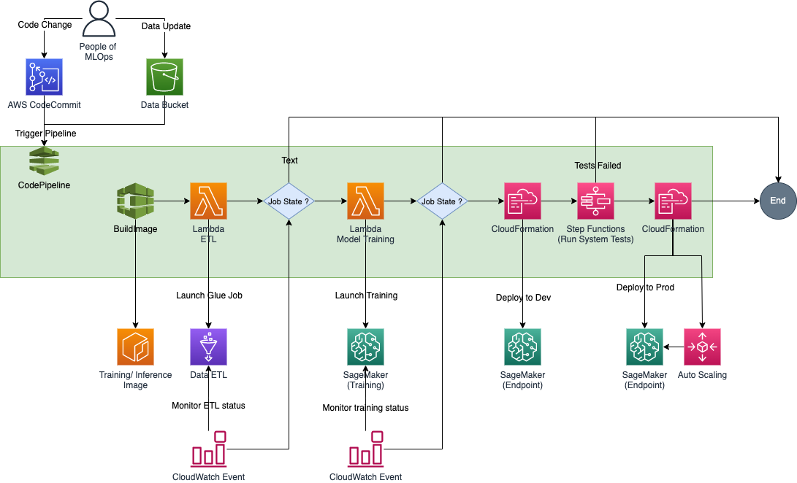

# DevOps Playground: July 2022 - Introduction to MLOps 

1. [Overview](#overview)
2. [Repository Details](#repository-details)
    1. [Pipeline Folder](#pipeline-folder)
    2. [Utils Folder](#utils-folder)
    3. [ETL Folder](#etl-folder)
    4. [Model Folder](#model-folder)
    5. [Tests Folder](#tests-folder)
3. [Steps to Create MLOps Pipeline](#steps-to-create-mlops-pipeline)

## Overview
In this session we will take a deep dive into 
- Understanding MLOps
- How MLOps is implemented in ML lifecycle?
- How does MLOps relate to DevOps?
- who are the people of MLOps?
- why do we need MLOps?

We shall then create our first MLOps pipeline using AWS Stack:
- CodeCommit
- CodePipeline
- Step Functions
- Amazon SageMaker

The ML model's job in this example is to forecast which potential consumers are most likely to engage with a particular offer using data from the Target Direct Marketing - Bank dataset. Data for this is obtained from [AWS autopilot direct marketing dataset](https://sagemaker-sample-data-us-west-2.s3-us-west-2.amazonaws.com/autopilot/direct_marketing/bank-additional.zip)

## Repository Details
All the resources needed to assemble the parts of an MLOps pipeline are contained in this repository.

### Pipeline Folder
Contains all the resources required to build and deploy the components for MLOps pipeline. 
- **ModelGroup:** Contains a lambda function to create an Amazon SageMaker Model Registry that contains a group of versioned ML models
- **ETLLaunchJob:** Contains a lambda function to launch the Glue ETL job.
- **ETLJobMonitor:** Contains a lambda function to monitor the progress/ status of above launched GLue ETL job. The success/ failure status of the job is then fed into the CodePipeline ETLApproval.
- **TrainingLaunchJob:** Contains a lambda function to launch an Amazon SageMaker Training job.
- **TrainingJobMonitor:** Contains a lambda function to monitor the progress/ status of above launched Amazon SageMaker Training job. The success/ failure status of the job is then fed into the CodePipeline TrainApproval.
- **MLOpsPipeline:** This is the CloudFormation template to create below resources
    - deploy all the lambda functions.
    - create an AWS CodeBuild project to build the training and inference container - "BuildImageProject".
    - create an AWS CodeBuild project to build system test workflow - "BuildWorkflowProject".
    - create an AWS CodeBuild project to customize a CloudFormation template to deploy Development and Production models - "BuildDeploymentProject".
    - create an IAM Role with {ModelName} and access Policy MLOps to create and manage resources in pipeline.

### Utils Folder
Contains the scripts to manual checks on pipeline resources
- **Prod Load:** Simulates load on production endpoint using the testing dataset from output of ETL job.
- **Validate Resource:** Validates if pipeline required S3 buckets and ECR container is created and available.

### ETL Folder
Contains the code to perform data pre-processing and provide a prepared data for training, validation, testing and baseline. Details of the code can be checked [here](etl).

### Model Folder
Contains the code for model using a BYOC (Bring Your Own Container) scenario. Details of the modelling and BYOC can be checked [here](model).

### Tests Folder
Contains the code to perform automated System Tests once the model has been deployed to Development/ QA endpoint. Details of the System Test workflow can be checked [here](tests)

## Steps to Create MLOps Pipeline
We will be working to create and deploy below architecture. Navigate to [Steps for MLOps Pipeline](Steps-to-Follow.md) to start with building your first MLOps pipeline.
